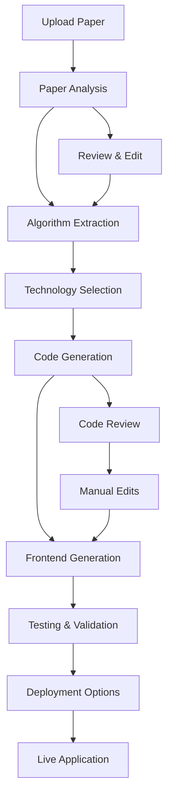

# Paper2Code Cloud Platform - Product Requirements Document

## Executive Summary

**Product Name**: Paper2Code Cloud Platform  
**Version**: 2.0  
**Target Release**: Q2 2025  
**Document Version**: 1.0  
**Last Updated**: January 2025  

### Vision Statement
Transform the Paper2Code system into a scalable, cloud-native platform that automatically converts research papers into complete, deployable applications with integrated frontend interfaces, democratizing access to academic algorithm implementation.

### Mission
Enable researchers, developers, and organizations to instantly transform academic research into production-ready applications with minimal technical overhead, accelerating innovation cycles from months to minutes.

---

## 1. Product Overview

### 1.1 Current State Analysis
The existing DeepCode Paper2Code system demonstrates strong capabilities in:
- Multi-agent orchestration for research paper analysis
- Algorithm extraction and implementation generation
- MCP-based tool integration
- Local deployment with CLI/Web interfaces

### 1.2 Identified Gaps & Opportunities
1. **Deployment Complexity**: Current system requires local setup and configuration
2. **Frontend Integration**: Generated code lacks integrated user interfaces
3. **Scalability Limitations**: Single-user, local processing constraints
4. **Cloud Accessibility**: No cloud-native deployment options
5. **Collaboration Features**: Missing team collaboration and sharing capabilities

### 1.3 Proposed Solution
A cloud-native Paper2Code platform that combines:
- **Enhanced Paper2Code Engine**: Improved algorithm extraction and implementation
- **Integrated Text2Web Frontend**: Automatic UI generation for implemented algorithms
- **Cloud Deployment Pipeline**: One-click deployment to Netlify/Google Cloud
- **Collaborative Workspace**: Team-based project management and sharing

---

## 2. Product Goals & Success Metrics

### 2.1 Primary Goals
1. **Accessibility**: Enable instant access without local installation
2. **Completeness**: Generate full-stack applications with frontend interfaces
3. **Scalability**: Support concurrent users and large-scale processing
4. **Deployment**: One-click deployment to production environments
5. **Collaboration**: Enable team-based research-to-code workflows

### 2.2 Success Metrics
- **User Adoption**: 10,000+ registered users within 6 months
- **Processing Speed**: <5 minutes average paper-to-deployed-app time
- **Success Rate**: >85% successful paper-to-code conversions
- **User Satisfaction**: >4.5/5 user rating
- **Revenue**: $100K+ ARR within 12 months

### 2.3 Key Performance Indicators (KPIs)
- Daily/Monthly Active Users (DAU/MAU)
- Paper processing success rate
- Average time-to-deployment
- User retention rate (30-day, 90-day)
- Generated application uptime/performance

---

## 3. Target Audience & User Personas

### 3.1 Primary Personas

#### Academic Researcher (Dr. Sarah)
- **Role**: PhD researcher/Professor
- **Pain Points**: Limited coding expertise, time constraints for implementation
- **Goals**: Quickly validate research ideas, create demos for conferences
- **Usage**: Upload papers, generate implementations, share with colleagues

#### Enterprise R&D Engineer (Mark)
- **Role**: Senior Software Engineer at tech company
- **Pain Points**: Slow research-to-prototype cycles, complex algorithm implementation
- **Goals**: Rapid prototyping, competitive analysis, innovation acceleration
- **Usage**: Batch processing papers, team collaboration, production deployment

#### Independent Developer (Alex)
- **Role**: Freelance developer/Startup founder
- **Pain Points**: Limited research access, complex algorithm understanding
- **Goals**: Build innovative products, implement cutting-edge algorithms
- **Usage**: Individual projects, client work, product development

### 3.2 Secondary Personas
- **Academic Institutions**: Research labs, universities
- **Consulting Firms**: Technical consulting, research analysis
- **Government Agencies**: Technology assessment, research evaluation

---

## 4. Functional Requirements

### 4.1 Core Paper2Code Engine (Enhanced)

#### 4.1.1 Document Processing
- **Multi-format Support**: PDF, DOCX, HTML, TXT, MD, LaTeX
- **Intelligent Segmentation**: Handle papers >100K tokens with semantic chunking
- **Mathematical Notation**: LaTeX/MathJax parsing and code conversion
- **Figure Analysis**: Algorithm flowcharts and diagram interpretation
- **Reference Extraction**: Automatic citation and dependency analysis

#### 4.1.2 Algorithm Extraction & Analysis
- **Deep Paper Understanding**: Advanced NLP for algorithm identification
- **Complexity Analysis**: Automatic Big-O notation and performance assessment
- **Dependency Mapping**: Required libraries and frameworks identification
- **Pseudocode Generation**: Intermediate algorithm representation
- **Implementation Planning**: Architecture and design pattern selection

#### 4.1.3 Multi-Language Code Generation
- **Primary Languages**: Python, JavaScript/TypeScript, Java, C++
- **Framework Integration**: TensorFlow, PyTorch, React, Express.js
- **Code Quality**: Static analysis, linting, documentation generation
- **Test Suite Creation**: Unit tests, integration tests, performance benchmarks
- **Error Handling**: Robust exception handling and logging

### 4.2 Integrated Text2Web Frontend Generation

#### 4.2.1 Automatic UI Generation
- **Algorithm Interfaces**: Input forms, parameter controls, output visualization
- **Interactive Demos**: Real-time algorithm execution and results display
- **Responsive Design**: Mobile-first, cross-device compatibility
- **Accessibility**: WCAG 2.1 AA compliance
- **Theme Customization**: Brand colors, typography, layout options

#### 4.2.2 Visualization Components
- **Data Visualization**: Charts, graphs, interactive plots (D3.js, Chart.js)
- **Algorithm Animation**: Step-by-step execution visualization
- **Performance Metrics**: Real-time performance monitoring displays
- **Result Export**: PDF, CSV, JSON export capabilities
- **Sharing Features**: Social sharing, embed codes, public galleries

#### 4.2.3 Frontend Framework Options
- **React/Next.js**: Modern, SEO-friendly applications
- **Vue.js/Nuxt.js**: Progressive web applications
- **Vanilla JS**: Lightweight, framework-agnostic solutions
- **Progressive Web App**: Offline capability, mobile optimization

### 4.3 Cloud Infrastructure & Deployment

#### 4.3.1 Multi-Cloud Support
**Netlify Integration**:
- Automatic build and deployment pipelines
- CDN optimization and global distribution
- Branch previews and rollback capabilities
- Custom domain support and SSL certificates
- Serverless function integration

**Google Cloud Platform Integration**:
- App Engine for scalable application hosting
- Cloud Run for containerized deployments
- Cloud Functions for serverless processing
- Cloud Storage for asset management
- Cloud CDN for global content delivery

#### 4.3.2 DevOps & CI/CD Pipeline
- **Automated Testing**: Unit, integration, and end-to-end testing
- **Code Quality Gates**: Static analysis, security scanning
- **Performance Monitoring**: Application performance and user analytics
- **Rollback Mechanisms**: Instant rollback on deployment failures
- **Environment Management**: Development, staging, production environments

### 4.4 Collaboration & Project Management

#### 4.4.1 Team Workspace
- **Project Sharing**: Team-based project access and management
- **Version Control**: Git-based versioning with branch management
- **Comment System**: Inline code comments and review system
- **Access Control**: Role-based permissions (Owner, Editor, Viewer)
- **Activity Tracking**: Detailed audit logs and activity feeds

#### 4.4.2 Public Gallery & Marketplace
- **Public Projects**: Showcase implemented algorithms
- **Template Library**: Pre-built templates and common patterns
- **Community Contributions**: User-submitted improvements and extensions
- **Rating System**: Quality ratings and user feedback
- **Search & Discovery**: Advanced filtering and categorization

---

## 5. Non-Functional Requirements

### 5.1 Performance Requirements
- **Processing Speed**: <5 minutes for typical research paper (10-30 pages)
- **Concurrent Users**: Support 1,000+ simultaneous users
- **Uptime**: 99.9% availability SLA
- **Response Time**: <3 seconds for UI interactions
- **Scalability**: Auto-scaling based on demand

### 5.2 Security & Privacy
- **Data Encryption**: End-to-end encryption for sensitive research
- **Access Control**: OAuth 2.0, SSO integration (Google, GitHub, ORCID)
- **Privacy Compliance**: GDPR, CCPA compliance
- **Audit Logging**: Comprehensive security audit trails
- **Vulnerability Management**: Regular security assessments and updates

### 5.3 Reliability & Availability
- **Fault Tolerance**: Graceful degradation and error recovery
- **Data Backup**: Automated backups with point-in-time recovery
- **Monitoring**: Real-time system health and performance monitoring
- **Incident Response**: 24/7 monitoring with automated alerting
- **Disaster Recovery**: Cross-region redundancy and failover

### 5.4 Usability & Accessibility
- **User Experience**: Intuitive, self-service interface
- **Documentation**: Comprehensive user guides and API documentation
- **Accessibility**: WCAG 2.1 AA compliance
- **Internationalization**: Multi-language support
- **Mobile Optimization**: Responsive design for all devices

---

## 6. Technical Architecture

### 6.1 System Architecture Overview

```
┌─────────────────────────────────────────────────────────────────┐
│                        Frontend Layer                           │
├─────────────────────────────────────────────────────────────────┤
│  Web UI (React)  │  Mobile PWA  │  CLI Tool  │  API Dashboard   │
└─────────────────────────────────────────────────────────────────┘
                                  │
┌─────────────────────────────────────────────────────────────────┐
│                         API Gateway                             │
├─────────────────────────────────────────────────────────────────┤
│  Authentication  │  Rate Limiting  │  Load Balancing  │  Caching │
└─────────────────────────────────────────────────────────────────┘
                                  │
┌─────────────────────────────────────────────────────────────────┐
│                      Microservices Layer                       │
├─────────────────────────────────────────────────────────────────┤
│ Paper Analysis │ Code Generation │ Frontend Gen │ Deployment Svc │
│    Service     │     Service     │   Service    │    Service     │
└─────────────────────────────────────────────────────────────────┘
                                  │
┌─────────────────────────────────────────────────────────────────┐
│                      Data & Storage Layer                      │
├─────────────────────────────────────────────────────────────────┤
│   PostgreSQL   │   Redis Cache   │  Cloud Storage │  Vector DB   │
│   (Projects)   │   (Sessions)    │   (Files)      │ (Embeddings) │
└─────────────────────────────────────────────────────────────────┘
```

### 6.2 Core Services

#### 6.2.1 Paper Analysis Service
- **Technology**: Python, FastAPI, Celery
- **AI Models**: Claude 3.5 Sonnet, GPT-4, custom fine-tuned models
- **Processing**: Async task queue with Redis
- **Storage**: Vector database for semantic search

#### 6.2.2 Code Generation Service
- **Technology**: Python, Node.js, Docker containers
- **Code Analysis**: AST parsing, static analysis tools
- **Template Engine**: Jinja2 for dynamic code generation
- **Quality Assurance**: ESLint, Black, Prettier integration

#### 6.2.3 Frontend Generation Service
- **Technology**: Node.js, React, Vue.js templates
- **UI Framework**: Material-UI, Tailwind CSS, Bootstrap
- **Bundling**: Webpack, Vite for optimized builds
- **Testing**: Jest, Cypress for automated testing

#### 6.2.4 Deployment Service
- **Technology**: Python, Terraform, Docker
- **Cloud Integration**: Netlify CLI, Google Cloud SDK
- **Pipeline**: GitHub Actions, GitLab CI/CD
- **Monitoring**: Datadog, New Relic integration

### 6.3 Cloud Infrastructure

#### 6.3.1 Deployment Options

**Option 1: Netlify-First Architecture**
```yaml
Services:
  - Frontend: Netlify Edge (Global CDN)
  - API: Netlify Functions (Serverless)
  - Database: Supabase (PostgreSQL)
  - Storage: Netlify Large Media
  - Processing: AWS Lambda (Heavy compute)
  
Benefits:
  - Simple deployment and scaling
  - Built-in CDN and SSL
  - Cost-effective for small-medium scale
  - Developer-friendly workflow
```

**Option 2: Google Cloud Native**
```yaml
Services:
  - Frontend: Cloud CDN + Cloud Storage
  - API: Cloud Run (Containerized)
  - Database: Cloud SQL (PostgreSQL)
  - Storage: Cloud Storage buckets
  - Processing: Cloud Functions + Compute Engine
  
Benefits:
  - Enterprise-grade scalability
  - Advanced ML/AI integration
  - Comprehensive monitoring
  - Multi-region deployment
```

**Option 3: Hybrid Architecture (Recommended)**
```yaml
Services:
  - Frontend: Netlify (Development/Small projects)
  - Enterprise: Google Cloud (Large-scale processing)
  - Database: Shared PostgreSQL cluster
  - Storage: Multi-cloud asset distribution
  - Processing: Auto-scaling based on demand
  
Benefits:
  - Best of both platforms
  - Cost optimization
  - Risk distribution
  - Flexible scaling options
```

### 6.4 Data Models

#### 6.4.1 Core Entities
```sql
-- Users and Organizations
CREATE TABLE users (
    id UUID PRIMARY KEY,
    email VARCHAR(255) UNIQUE NOT NULL,
    name VARCHAR(255) NOT NULL,
    avatar_url VARCHAR(500),
    subscription_tier VARCHAR(50) DEFAULT 'free',
    created_at TIMESTAMP DEFAULT NOW()
);

CREATE TABLE organizations (
    id UUID PRIMARY KEY,
    name VARCHAR(255) NOT NULL,
    owner_id UUID REFERENCES users(id),
    subscription_tier VARCHAR(50) DEFAULT 'team',
    created_at TIMESTAMP DEFAULT NOW()
);

-- Projects and Papers
CREATE TABLE projects (
    id UUID PRIMARY KEY,
    name VARCHAR(255) NOT NULL,
    description TEXT,
    owner_id UUID REFERENCES users(id),
    organization_id UUID REFERENCES organizations(id),
    visibility VARCHAR(20) DEFAULT 'private', -- private, public, team
    status VARCHAR(20) DEFAULT 'draft', -- draft, processing, completed, deployed
    created_at TIMESTAMP DEFAULT NOW(),
    updated_at TIMESTAMP DEFAULT NOW()
);

CREATE TABLE papers (
    id UUID PRIMARY KEY,
    project_id UUID REFERENCES projects(id),
    title VARCHAR(500),
    authors TEXT[],
    abstract TEXT,
    file_url VARCHAR(500),
    file_type VARCHAR(20),
    processing_status VARCHAR(20) DEFAULT 'pending',
    extracted_algorithms JSONB,
    created_at TIMESTAMP DEFAULT NOW()
);

-- Generated Code and Deployments
CREATE TABLE generated_code (
    id UUID PRIMARY KEY,
    project_id UUID REFERENCES projects(id),
    language VARCHAR(50) NOT NULL,
    framework VARCHAR(100),
    code_files JSONB NOT NULL,
    test_files JSONB,
    documentation TEXT,
    performance_metrics JSONB,
    created_at TIMESTAMP DEFAULT NOW()
);

CREATE TABLE deployments (
    id UUID PRIMARY KEY,
    project_id UUID REFERENCES projects(id),
    platform VARCHAR(50) NOT NULL, -- netlify, google-cloud
    deployment_url VARCHAR(500),
    status VARCHAR(20) DEFAULT 'pending', -- pending, building, deployed, failed
    build_logs TEXT,
    environment_vars JSONB,
    custom_domain VARCHAR(255),
    created_at TIMESTAMP DEFAULT NOW()
);
```

---

## 7. User Experience Design

### 7.1 User Flow Overview

#### 7.1.1 New User Onboarding
1. **Landing Page**: Value proposition, demo videos, pricing
2. **Registration**: OAuth sign-up with GitHub/Google
3. **Welcome Tutorial**: Interactive product tour
4. **First Project**: Guided paper upload and processing
5. **Success Moment**: Generated application deployment

#### 7.1.2 Core User Journey


### 7.2 Key Interface Components

#### 7.2.1 Dashboard
- **Project Gallery**: Grid view of user projects with preview cards
- **Quick Actions**: Upload paper, create new project, browse templates
- **Activity Feed**: Recent activities, team updates, system notifications
- **Usage Analytics**: Processing statistics, deployment metrics
- **Resource Management**: Storage usage, API limits, billing information

#### 7.2.2 Paper Processing Interface
- **Upload Zone**: Drag-and-drop with progress indicators
- **Paper Preview**: PDF viewer with annotation capabilities
- **Analysis Results**: Extracted algorithms, complexity analysis
- **Parameter Tuning**: Processing options, language preferences
- **Real-time Progress**: Step-by-step processing visualization

#### 7.2.3 Code Editor
- **Multi-file Editor**: Tabbed interface with syntax highlighting
- **Live Preview**: Real-time application preview
- **Version Control**: Git-style diff viewing and branch management
- **Collaboration**: Real-time editing, comments, suggestions
- **Testing Panel**: Automated test results, performance metrics

#### 7.2.4 Deployment Dashboard
- **Platform Selection**: Netlify vs Google Cloud options
- **Environment Configuration**: Environment variables, secrets management
- **Build Pipeline**: Real-time build logs and status
- **Domain Management**: Custom domains, SSL certificates
- **Performance Monitoring**: Uptime, response times, error rates

### 7.3 Mobile Experience
- **Progressive Web App**: Offline capabilities, push notifications
- **Responsive Design**: Optimized for tablets and smartphones
- **Core Features**: Project management, deployment monitoring
- **Simplified Interface**: Touch-optimized controls and navigation

---

## 8. Implementation Roadmap

### 8.1 Phase 1: Foundation (Months 1-3)
**MVP Core Features**
- [ ] Basic paper upload and processing
- [ ] Simple algorithm extraction
- [ ] Python code generation
- [ ] Basic React frontend generation
- [ ] Netlify deployment integration
- [ ] User authentication and project management

**Technical Milestones**
- [ ] Core microservices architecture
- [ ] PostgreSQL database setup
- [ ] Basic CI/CD pipeline
- [ ] Security framework implementation

### 8.2 Phase 2: Enhancement (Months 4-6)
**Advanced Features**
- [ ] Multi-language code generation (JavaScript, Java)
- [ ] Advanced UI components and visualizations
- [ ] Google Cloud deployment integration
- [ ] Team collaboration features
- [ ] Public project gallery

**Technical Improvements**
- [ ] Performance optimization
- [ ] Advanced error handling
- [ ] Monitoring and analytics
- [ ] API rate limiting and quotas

### 8.3 Phase 3: Scale & Polish (Months 7-9)
**Enterprise Features**
- [ ] Organization management
- [ ] Advanced access controls
- [ ] White-label solutions
- [ ] Enterprise integrations (SSO, SCIM)
- [ ] Advanced analytics and reporting

**Platform Maturity**
- [ ] Multi-region deployment
- [ ] 99.9% uptime SLA
- [ ] Comprehensive documentation
- [ ] 24/7 support infrastructure

### 8.4 Phase 4: Innovation (Months 10-12)
**Cutting-Edge Features**
- [ ] AI-powered code optimization
- [ ] Automated performance tuning
- [ ] Integration marketplace
- [ ] Custom model fine-tuning
- [ ] Advanced visualization libraries

---

## 9. Business Model & Monetization

### 9.1 Pricing Tiers

#### 9.1.1 Free Tier
- **Price**: $0/month
- **Limits**: 3 papers/month, public projects only
- **Features**: Basic paper processing, Netlify deployment
- **Support**: Community forum
- **Target**: Individual researchers, students

#### 9.1.2 Pro Tier
- **Price**: $29/month
- **Limits**: 50 papers/month, unlimited projects
- **Features**: All languages, private projects, priority processing
- **Support**: Email support, extended processing time
- **Target**: Professional developers, consultants

#### 9.1.3 Team Tier
- **Price**: $99/month (up to 5 users)
- **Limits**: 200 papers/month, team collaboration
- **Features**: Organization management, advanced analytics
- **Support**: Priority support, custom integrations
- **Target**: Small teams, startups

#### 9.1.4 Enterprise Tier
- **Price**: Custom pricing
- **Limits**: Unlimited usage, dedicated resources
- **Features**: White-label, SSO, custom deployment
- **Support**: Dedicated account manager, SLA
- **Target**: Large organizations, academic institutions

### 9.2 Revenue Projections
- **Year 1**: $500K ARR (500 Pro + 50 Team + 5 Enterprise)
- **Year 2**: $2M ARR (1,500 Pro + 200 Team + 25 Enterprise)
- **Year 3**: $5M ARR (3,000 Pro + 500 Team + 75 Enterprise)

---

## 10. Risk Assessment & Mitigation

### 10.1 Technical Risks

#### 10.1.1 AI Model Performance
**Risk**: Inconsistent paper analysis and code generation quality
**Impact**: High - Core product functionality
**Mitigation**: 
- Multiple model validation
- Human-in-the-loop quality checks
- Continuous model fine-tuning
- Fallback mechanisms

#### 10.1.2 Scalability Challenges
**Risk**: System performance degradation under load
**Impact**: Medium - User experience issues
**Mitigation**: 
- Auto-scaling infrastructure
- Performance monitoring
- Load testing protocols
- Caching strategies

#### 10.1.3 Deployment Reliability
**Risk**: Failed deployments causing user frustration
**Impact**: Medium - User retention issues
**Mitigation**: 
- Multiple deployment providers
- Rollback mechanisms
- Extensive testing pipelines
- User notification systems

### 10.2 Business Risks

#### 10.2.1 Market Competition
**Risk**: Large tech companies launching similar products
**Impact**: High - Market share loss
**Mitigation**: 
- Focus on academic research niche
- Build strong community
- Continuous innovation
- Strategic partnerships

#### 10.2.2 Intellectual Property
**Risk**: Copyright issues with generated code
**Impact**: High - Legal liability
**Mitigation**: 
- Clear terms of service
- Code attribution systems
- Legal review processes
- Insurance coverage

### 10.3 Operational Risks

#### 10.3.1 Data Security
**Risk**: Research paper data breaches
**Impact**: High - Trust and compliance issues
**Mitigation**: 
- End-to-end encryption
- Regular security audits
- Compliance certifications
- Incident response plans

#### 10.3.2 Vendor Dependencies
**Risk**: Cloud provider outages or pricing changes
**Impact**: Medium - Service disruption
**Mitigation**: 
- Multi-cloud strategy
- Vendor diversification
- Cost monitoring
- Contract negotiations

---

## 11. Success Criteria & KPIs

### 11.1 Product Metrics
- **Paper Processing Success Rate**: >90%
- **Code Compilation Success Rate**: >95%
- **Deployment Success Rate**: >98%
- **Average Processing Time**: <5 minutes
- **User-Generated Applications**: 10,000+ live apps

### 11.2 User Engagement Metrics
- **Monthly Active Users**: 5,000+
- **Daily Active Users**: 1,000+
- **Session Duration**: >15 minutes average
- **Return User Rate**: >60% (30-day)
- **Net Promoter Score**: >50

### 11.3 Business Metrics
- **Monthly Recurring Revenue**: $100K+
- **Customer Acquisition Cost**: <$50
- **Customer Lifetime Value**: >$500
- **Churn Rate**: <5% monthly
- **Support Ticket Resolution**: <24 hours

### 11.4 Technical Metrics
- **System Uptime**: >99.9%
- **API Response Time**: <200ms (95th percentile)
- **Error Rate**: <0.1%
- **Page Load Time**: <3 seconds
- **Security Incidents**: 0 critical incidents

---

## 12. Conclusion & Next Steps

### 12.1 Strategic Advantages
1. **First-Mover Advantage**: Pioneer in automated research-to-code deployment
2. **Academic Focus**: Strong niche positioning in research community
3. **Full-Stack Solution**: Complete pipeline from paper to deployed application
4. **Cloud-Native**: Scalable, accessible, and maintainable architecture
5. **Community Building**: Open-source foundation with commercial features

### 12.2 Immediate Actions Required
1. **Technical Architecture Validation**: Proof-of-concept development
2. **Market Research**: User interviews and competitive analysis
3. **Partnership Exploration**: Netlify and Google Cloud partnerships
4. **Team Building**: Hiring key engineering and product roles
5. **Funding Strategy**: Seed round preparation and investor outreach

### 12.3 Long-Term Vision
Transform Paper2Code from a local tool into the industry standard for automated research implementation, enabling a new paradigm where academic breakthroughs become instantly accessible as production applications, accelerating global innovation cycles.

---

**Document Authors**: Product Team  
**Stakeholder Review**: Engineering, Design, Business  
**Approval Required**: CTO, CPO, CEO  
**Next Review Date**: February 2025
